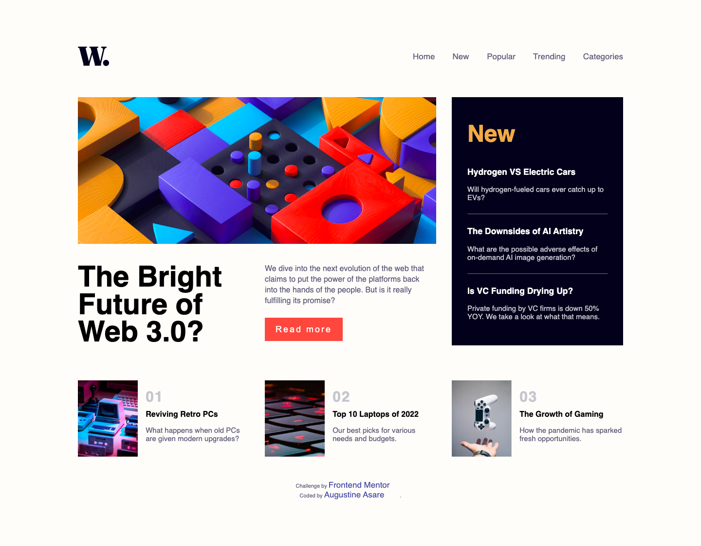

# Frontend Mentor - News homepage solution

This is a solution to the [News homepage challenge on Frontend Mentor](https://www.frontendmentor.io/challenges/news-homepage-H6SWTa1MFl). Frontend Mentor challenges help you improve your coding skills by building realistic projects.

## Table of contents

- [Overview](#overview)
  - [The challenge](#the-challenge)
  - [Screenshot](#screenshot)
  - [Links](#links)
- [My process](#my-process)
  - [Built with](#built-with)
  - [What I learned](#what-i-learned)
  - [Continued development](#continued-development)
- [Author](#author)
- [Acknowledgments](#acknowledgments)

**Note: Delete this note and update the table of contents based on what sections you keep.**

## Overview

### The challenge

The challenge is to build out this news website homepage and get it looking as close to the design as possible.

it is pemissible to use any tools you like to help you complete the challenge. So if you've got something you'd like to practice, feel free to give it a go.

Users should be able to:

- View the optimal layout for the interface depending on their device's screen size
- See hover and focus states for all interactive elements on the page

### Screenshot




### Links

- Solution URL: [Add solution URL here](https://your-solution-url.com)
- Live Site URL: [Add live site URL here](https://your-live-site-url.com)

## My process

### Built with

- Semantic HTML5 markup
- CSS custom properties
- CSS Grid
- Desktop-first workflow
- JavaScript

### What I learned

It was great leearning about Semantic HTML and puting it into pratice. I realised that it was much easier applying css styles to my HTML structure when i adopted the semantic HTML5 markup.

My main purpose for attempting this challenge was to practice the basic knowledge i have acquired in JavaScript. No JS library was used.

```html
<h1>Some HTML and JavaScript codes I'm proud of</h1>

<nav>
  <a href="#"> Home</a>
  <a href="#">New </a>
  <a href="#">Popular</a>
  <a href="#">Trending</a>
  <a href="#">Categories</a>
</nav>

<menu class="menu-list">
  
  <a href="#"> Home</a>
  <a href="#">New </a>
  <a href="#">Popular</a>
  <a href="#">Trending</a>
  <a href="#">Categories</a>
</menu>
```

```js
function handleClick() {
  document.querySelector(".menu-list").classList.add("display");
}

function menuRemover() {
  document.querySelector(".menu-list").classList.remove("display");
}
```

### Continued development
I am going to look more into semantic HTML and JavaScript. After, I am going to look into working with JS libraries.


## Author

- Website - [Augustine A. Asare](https://github.com/AustinKing5)
- Frontend Mentor - [@AustinKing5](https://www.frontendmentor.io/profile/AustinKing5)
- Twitter - [@aryetehasare](https://www.twitter.com/aryetehasare)


## Acknowledgments

My Gratitude goaes to Lucas (Frontend Mentor username: @correlucas) and Nneoma Njoku (Frontend Mentor username: @SatellitePeace) who introduced me to semantic HTML and helped me improve in making my websites responsive. critiquing my previous solutions to Frontend Mentor challenges boosted my confidence while giving me a roadmap to some of significant concepts i needed to learn in frontend development learning journey. 
